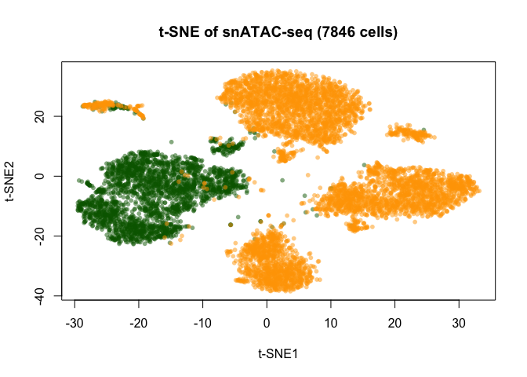

snATAC-seq of mouse mammary cells
================
Jay Chung |
Feb 2019

Raw files can be downloaded here:
<https://www.ncbi.nlm.nih.gov/geo/query/acc.cgi?acc=GSE125523>

Install the snATAC tool: <https://github.com/r3fang/snATAC>

The full dataset can be visualized here:
<https://jc-bioinfo.shinyapps.io/TF_plots/>

## Sequence alignment and pre-processing

``` bash
# Combine fastq files from the two sequencing run
gzcat Mammary_fetal_rep1.demultiplexed.R1.repl1.fastq.gz Mammary_v2_fetal_rep1.demultiplexed.R1.repl1.fastq.gz | gzip > Mammary_v1+2_fetal_rep1.demultiplexed.R1.repl1.fastq.gz
gzcat Mammary_fetal_rep1.demultiplexed.R2.repl1.fastq.gz Mammary_v2_fetal_rep1.demultiplexed.R2.repl1.fastq.gz | gzip > Mammary_v1+2_fetal_rep1.demultiplexed.R2.repl1.fastq.gz
gzcat Mammary_fetal_rep2.demultiplexed.R1.repl1.fastq.gz Mammary_v2_fetal_rep2.demultiplexed.R1.repl1.fastq.gz | gzip > Mammary_v1+2_fetal_rep2.demultiplexed.R1.repl1.fastq.gz
gzcat Mammary_fetal_rep2.demultiplexed.R2.repl1.fastq.gz Mammary_v2_fetal_rep2.demultiplexed.R2.repl1.fastq.gz | gzip > Mammary_v1+2_fetal_rep2.demultiplexed.R2.repl1.fastq.gz
gzcat Mammary_adult_rep1.demultiplexed.R1.repl1.fastq.gz Mammary_v2_adult_rep1.demultiplexed.R1.repl1.fastq.gz | gzip > Mammary_v1+2_adult_rep1.demultiplexed.R1.repl1.fastq.gz
gzcat Mammary_adult_rep1.demultiplexed.R2.repl1.fastq.gz Mammary_v2_adult_rep1.demultiplexed.R2.repl1.fastq.gz | gzip > Mammary_v1+2_adult_rep1.demultiplexed.R2.repl1.fastq.gz
gzcat Mammary_adult_rep2.demultiplexed.R1.repl1.fastq.gz Mammary_v2_adult_rep2.demultiplexed.R1.repl1.fastq.gz | gzip > Mammary_v1+2_adult_rep2.demultiplexed.R1.repl1.fastq.gz
gzcat Mammary_adult_rep2.demultiplexed.R2.repl1.fastq.gz Mammary_v2_adult_rep2.demultiplexed.R2.repl1.fastq.gz | gzip > Mammary_v1+2_adult_rep2.demultiplexed.R2.repl1.fastq.gz

# Make sample name file
ls *.gz | sort | sed 's/.R[1-2].repl1.fastq.gz//' | sort -u > sample_name.txt

# Low quality base trimming
#!/bin/bash
names=($(cat sample_name.txt))
for FILES in "${names[@]}"
do 
    sickle pe -f ./$FILES.R1.repl1.fastq.gz -r ./$FILES.R2.repl1.fastq.gz -t sanger -o ./$FILES.R1.repl1.trim.fastq.gz -p ./$FILES.R2.repl1.trim.fastq.gz -s ./$FILES.R1+2.repl1.trim.fastq.gz
    echo $FILES" QC trim done=========="
done

# Bowtie2 mapping of reads
#!/bin/bash
names=($(cat sample_name.txt))

for FILES in "${names[@]}"
do 
    bowtie2 -p 16 -t -X 2000 --no-mixed --no-discordant -x /Bowtie2Index/mm10/genome -1 ./$FILES.R1.repl1.trim.fastq.gz -2 ./$FILES.R2.repl1.trim.fastq.gz -S ./$FILES.sam
    echo "=========="$FILES" bowtie2 done=========="
done

# Sam-bam conversion and sort
cd ./bam/
find . -name "*.sam" | parallel -j 0 "samtools view -bS {} > {.}.bam"
find . -name "*.bam" | parallel -j 0 "samtools sort -t 5 -n {} -o {.}.nsrt.bam"

# Pre-processing
#!/bin/bash
for FILES in Mammary_v1+2_fetal_rep1 Mammary_v1+2_fetal_rep2 Mammary_v1+2_adult_rep1 Mammary_v1+2_adult_rep2
do
    snATAC pre -t 16 -m 30 -f 2000 -e 75 -i $FILES.demultiplexed.nsrt.bam -o $FILES.bed.gz 2> $FILES.snATAC.pre.log
    echo "=========="$FILES" snATAC pre done=========="
done

# Call peaks with aggregate profile
#!/bin/bash
for FILES in Mammary_v1+2_fetal_rep1 Mammary_v1+2_fetal_rep2 Mammary_v1+2_adult_rep1 Mammary_v1+2_adult_rep2
do
    macs2 callpeak -t $FILES.bed.gz -f BED -g mm --nolambda --nomodel --shift -100 --extsize 200 --keep-dup all -n ./$FILES\_macs2 --bdg --SPMR -q 5e-2
    echo "=========="$FILES" MACS2 done=========="
done
```

## Calculate QC statistics

``` bash
## Three QC statistics are calculated per cell:
## 1. Number of reads
## 2. Promoter coverage
## 3. Reads in peak ratio

## Count number of reads per barcode
# write a bash script for this: snATAC_readCounter.sh
#!/bin/bash
if [ "$#" -lt 1 ]
then
    echo "error: no file name"
    echo "usage: input the file name before '.bed.gz'"
    exit 1
fi

set -e
set -u
set -o pipefail

gzcat $1.bed.gz | awk '{print $4}' | sort | uniq -c | awk '{print $2,$1}' | sort -k1,1 > $1.reads_per_cell.txt

# run the script with parallel
find . -name "*.bed.gz" | sed 's/.bed.gz//' | parallel -j0 'snATAC_readCounter.sh {}'

## Promoter coverage
# using all protein coding promoters
# write a bash script for this: snATAC_promoter_cov.sh
#!/bin/bash
if [ "$#" -lt 2 ]
then
    echo "error: no file name"
    echo "usage: snATAC_promoter_cov.sh [file name of .bed.gz] [bed file of promoter]"
    exit 1
fi

set -e
set -u
set -o pipefail

intersectBed -wa -wb -a $1.bed.gz -b $2 \
    | awk '{print $4,$8}' \
    | sort \
    | uniq \
    | awk '{print $1}' \
    | uniq -c \
    | awk '{print $2,$1}' \
    | sort -k1,1 > $1.promoter_cov.txt

# run the script with parallel
find . -name "*.bed.gz" | sed 's/.bed.gz//' | parallel -j0 'snATAC_promoter_cov.sh {} mm10_protein_coding_genes_3kbTSS.bed'

## Reads in peak ratio
# write a bash script for this: snATAC_reads_in_peak.sh
#!/bin/bash
set -e
set -u
set -o pipefail

intersectBed -a $1.bed.gz -b $1\_macs2_peaks.narrowPeak -u \
    | awk '{print $4}' \
    | sort \
    | uniq -c \
    | awk '{print $2,$1}' \
    | sort -k1,1 > $1.reads_in_peak.txt

# Run the script with parallel
parallel -j0 snATAC_reads_in_peak.sh {} ::: Mammary_v1+2_fetal_rep1 Mammary_v1+2_fetal_rep2 Mammary_v1+2_adult_rep1 Mammary_v1+2_adult_rep2
```

## Feature (regions) selection

### Generate peak summit file (from macs2 call peaks from aggregate snATAC profile)

``` bash
cat Mammary_v1+2_fetal_rep1_macs2_summits.bed Mammary_v1+2_fetal_rep2_macs2_summits.bed Mammary_v1+2_adult_rep1_macs2_summits.bed Mammary_v1+2_adult_rep2_macs2_summits.bed | sort -k1,1 -k2,2n > sorted.bed
mergeBed -i sorted.bed > Mammary_fetal+adult_merged_macs2_summits.bed
```

### Read files:

``` r
library(GenomicRanges)
library(IRanges)
library(Matrix)
library(irlba)
library(Rtsne)
library(scales)
```

``` r
peaks.df <- read.table("Mammary_fetal+adult_merged_macs2_summits.bed")
nrow(peaks.df)
```

    ## [1] 437903

``` r
head(peaks.df)
```

    ##     V1      V2      V3
    ## 1 chr1 3100660 3100661
    ## 2 chr1 3203924 3203925
    ## 3 chr1 3203940 3203941
    ## 4 chr1 3212845 3212846
    ## 5 chr1 3212897 3212898
    ## 6 chr1 3212923 3212924

### Resize regions to 1 kb:

``` r
peaks.gr <- GRanges(seqnames = peaks.df[,1], 
                    ranges = IRanges(peaks.df[,2], peaks.df[,3]))
peaks.rs.gr <- resize(reduce(resize(peaks.gr, 1000, fix = "center")), 1000, fix = "center")
all(width(peaks.rs.gr) == 1000)
```

    ## [1] TRUE

``` r
peaks.rs.df <- as.data.frame(peaks.rs.gr)[,1:3]
nrow(peaks.rs.df)
```

    ## [1] 164657

### Separate promoters from enhancers:

``` r
proms.df <- read.table("mm10_protein_coding_genes_3kbTSS.bed")
proms.gr <- GRanges(seqnames = proms.df[,1], 
                    ranges = IRanges(proms.df[,2], proms.df[,3]))
peaks.np.gr <- peaks.rs.gr[-queryHits(findOverlaps(peaks.rs.gr, proms.gr))]
peaks.p.gr <- peaks.rs.gr[queryHits(findOverlaps(peaks.rs.gr, proms.gr))]
all(width(peaks.np.gr) == 1000)
```

    ## [1] TRUE

``` r
all(width(peaks.p.gr) == 1000)
```

    ## [1] TRUE

``` r
peaks.np.ex.df <- as.data.frame(peaks.np.gr)[,1:3]
peaks.p.ex.df <- as.data.frame(peaks.p.gr)[,1:3]
nrow(peaks.np.ex.df)
```

    ## [1] 145453

``` r
nrow(peaks.p.ex.df)
```

    ## [1] 21179

``` r
write.table(peaks.np.ex.df, "Mammary_v1+2_fetal+adult_distal.ygi", 
            row.names = FALSE, col.names = FALSE, quote = FALSE, sep = "\t")
write.table(peaks.p.ex.df, "Mammary_v1+2_fetal+adult_promoter.ygi", 
            row.names = FALSE, col.names = FALSE, quote = FALSE, sep = "\t")
```

### Generate binary matrix

``` bash
#!/bin/bash
for FILES in fMaSC_v1+2_rep1 fMaSC_v1+2_rep2 Adult_v1+2_rep1 Adult_v1+2_rep2
do
    snATAC bmat -i $FILES.bed.gz -x $FILES.xgi -y Mammary_v1+2_fetal+adult_distal.ygi -o >(gzip > $FILES.distal.mat.gz)
    snATAC bmat -i $FILES.bed.gz -x $FILES.xgi -y Mammary_v1+2_fetal+adult_promoter.ygi -o >(gzip > $FILES.promoter.mat.gz)
    echo $FILES" snATAC bmat done =========="
done

# Combine all cells into one file
# Binary matrix cell order is: 1-882 fMaSC1, 883-2577 fMaSC2, 2578-5042 adult1, 5043-7846 adult2
gzcat fMaSC_v1+2_rep1.distal.mat.gz fMaSC_v1+2_rep2.distal.mat.gz Adult_v1+2_rep1.distal.mat.gz Adult_v1+2_rep2.distal.mat.gz | gzip > fMaSC+adult_v1+2_rep1+2.distal.mat.gz
gzcat fMaSC_v1+2_rep1.promoter.mat.gz fMaSC_v1+2_rep2.promoter.mat.gz Adult_v1+2_rep1.promoter.mat.gz Adult_v1+2_rep2.promoter.mat.gz | gzip > fMaSC+adult_v1+2_rep1+2.promoter.mat.gz
```

### Binary matrix file compression

Convert into R sparse matrix and save as R binary file (to save
space)

``` r
all_distal_bmat <- read.table("fMaSC+adult_v1+2_rep1+2.distal.mat.gz") # this will take a while
all_distal_bmat_sm <- as(as.matrix(all_distal_bmat), "sparseMatrix")
save(all_distal_bmat_sm, file = "./fMaSC+adult_v1+2_rep1+2.distal.sparse_mat.RData")
```

## Data transformation and dimension reduction

``` r
load("./fMaSC+adult_v1+2_rep1+2.distal.sparse_mat.RData") # load sparse binary matrix
dim(all_distal_bmat_sm)
```

    ## [1]   7846 145453

### Remove bottom 10% usage regions

``` r
dcount <- as.vector(Matrix::colSums(all_distal_bmat_sm))
didx_keep <- which(dcount > quantile(dcount, probs = 0.1))
all_distal_bmat_sm <- all_distal_bmat_sm[,didx_keep]
all_distal_bmat_sm_t <- t(all_distal_bmat_sm) # transpose to row:regions, column:cells
```

### LSI of distal regions

``` r
nfreqs <- t(t(all_distal_bmat_sm_t) / Matrix::colSums(all_distal_bmat_sm_t))
idf <- as(log(1 + ncol(all_distal_bmat_sm_t) / Matrix::rowSums(all_distal_bmat_sm_t)), "sparseVector")
tf_idf_counts_distal <- as(Diagonal(x=as.vector(idf)), "sparseMatrix") %*% nfreqs
dim(tf_idf_counts_distal)
```

    ## [1] 130899   7846

``` r
set.seed(524)
bmat_svd <- irlba(tf_idf_counts_distal, 50, 50)
d_diagtsne <- matrix(0, 50, 50)
diag(d_diagtsne) <- bmat_svd$d
bmat_svd_vd <- t(d_diagtsne %*% t(bmat_svd$v))
dim(bmat_svd_vd)
```

    ## [1] 7846   50

### t-SNE of distal regions

Tune t-SNE by selecting lowest KL divergence:

``` r
tsne_svd <- vector("list", 9)
KL <- numeric()
par(mfrow=c(3,3))
set.seed(524)
for (i in 1:9){
  mat <- Rtsne(bmat_svd_vd, dims = 2, perplexity = 30, verbose = TRUE, 
               max_iter = 1000, check_duplicates = FALSE, is_distance = FALSE, 
               theta = 0.5, pca = FALSE, exaggeration_factor = 12)
  tsne_svd[[i]] <- mat$Y
  plot(tsne_svd[[i]], cex = 0.5, pch = 16, xlab = "t-SNE1", ylab = "t-SNE2", 
       main=paste0(i, "-TFIDF SVD t-SNE v1+2 distal"), col = alpha(col, 0.3))
  KL[i] <- round(min(mat$itercosts), 4)
  legend("topleft", paste0("KL = ", KL[i]), text.col = "black", bty = "n")
}
best_tsne <- tsne_svd[[which.min(KL)]] # lowest KL
write.csv(best_tsne, "./Bmat_tfidf_svd_tsne_best_v1+2_distal.csv")
```

``` r
best_tsne <- read.csv("./Bmat_tfidf_svd_tsne_best_v1+2_distal.csv", row.names = 1)
col <- c(rep("darkgreen", 2577), rep("orange", 5269)) # Fetal in green, adult in orange
plot(best_tsne, cex = 0.8, pch = 16, xlab = "t-SNE1", ylab = "t-SNE2", 
     main = "t-SNE of snATAC-seq (7846 cells)", col = alpha(col, 0.5))
```

<!-- -->

``` r
sessionInfo()
```

    ## R version 3.5.2 (2018-12-20)
    ## Platform: x86_64-apple-darwin15.6.0 (64-bit)
    ## Running under: macOS Mojave 10.14
    ## 
    ## Matrix products: default
    ## BLAS: /Library/Frameworks/R.framework/Versions/3.5/Resources/lib/libRblas.0.dylib
    ## LAPACK: /Library/Frameworks/R.framework/Versions/3.5/Resources/lib/libRlapack.dylib
    ## 
    ## locale:
    ## [1] en_US.UTF-8/en_US.UTF-8/en_US.UTF-8/C/en_US.UTF-8/en_US.UTF-8
    ## 
    ## attached base packages:
    ## [1] parallel  stats4    stats     graphics  grDevices utils     datasets 
    ## [8] methods   base     
    ## 
    ## other attached packages:
    ## [1] scales_1.0.0         Rtsne_0.13           irlba_2.3.2         
    ## [4] Matrix_1.2-15        GenomicRanges_1.32.7 GenomeInfoDb_1.16.0 
    ## [7] IRanges_2.14.12      S4Vectors_0.18.3     BiocGenerics_0.26.0 
    ## 
    ## loaded via a namespace (and not attached):
    ##  [1] Rcpp_1.0.0             knitr_1.20             XVector_0.20.0        
    ##  [4] magrittr_1.5           zlibbioc_1.26.0        munsell_0.5.0         
    ##  [7] colorspace_1.3-2       lattice_0.20-38        stringr_1.3.1         
    ## [10] tools_3.5.2            grid_3.5.2             htmltools_0.3.6       
    ## [13] yaml_2.2.0             digest_0.6.18          GenomeInfoDbData_1.1.0
    ## [16] bitops_1.0-6           RCurl_1.95-4.11        evaluate_0.12         
    ## [19] rmarkdown_1.11         stringi_1.2.4          compiler_3.5.2
